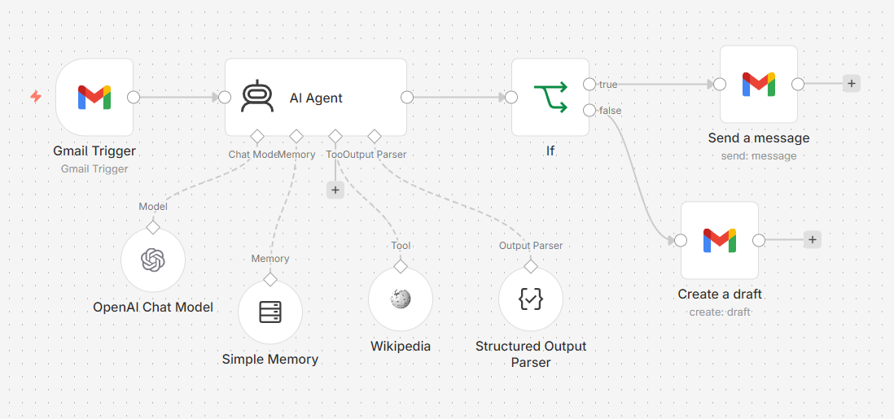

# AI Email Executive Agent 

An intelligent AI-powered email automation workflow.

This workflow automatically:

- Reads incoming Gmail emails
- Analyzes sentiment and urgency
- Detects spam/phishing risks
- Generates professional AI email replies
- Automatically sends replies OR creates drafts
- Uses memory for conversation continuity

---

# Features

## AI Email Analysis
- Tone detection
- Intent classification
- Urgency assessment
- Priority scoring
- Risk detection

## Smart Reply Generation
- Human-like professional responses
- Context-aware email drafting
- Executive assistant behavior

## Automation Logic
- Auto-send NORMAL emails
- Create draft for risky/critical emails

## Tools Used
- n8n
- OpenAI GPT-4o-mini
- Gmail API
- Structured Output Parser
- Wikipedia Tool
- Memory Buffer

---

# Workflow Overview



---

# How It Works

1. Gmail Trigger monitors unread emails
2. AI Agent analyzes the email
3. Structured JSON response is generated
4. IF node checks classification:
   - NORMAL → Auto Reply
   - CRITICAL → Draft Creation

---

# Installation

## Requirements

- n8n
- OpenAI API Key
- Gmail OAuth Credentials

## Steps

1. Clone this repository

```bash
git clone https://github.com/yourusername/ai-email-executive-agent.git

2. Import workflow/workflow.json into n8n
3. Configure:
4. Gmail OAuth
5. OpenAI API
6. Activate the workflow
